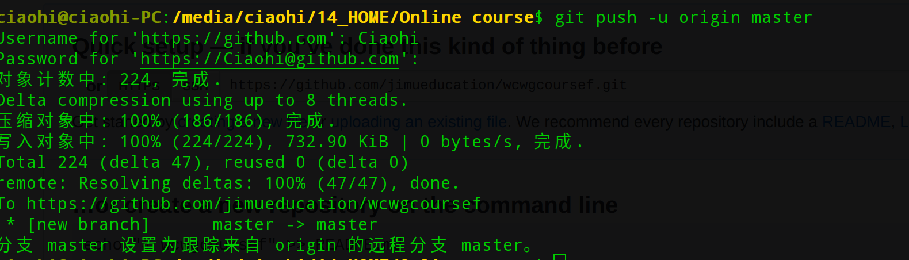

## git 提交代码操作步骤
1. 使用命令行初始化仓库 git init

2. 与代码无关的静态文件或引用模块不必上传，新建.gitignore,写上不必上传的文件

3.执行git add. 变化到本地仓库 git commit -m "注释信息"提交到本地仓库

4.设置远程仓库地址git remmote add origin 远程仓库地址

5.git push -u origin master 推送到远程仓库分支

6.成功提交
